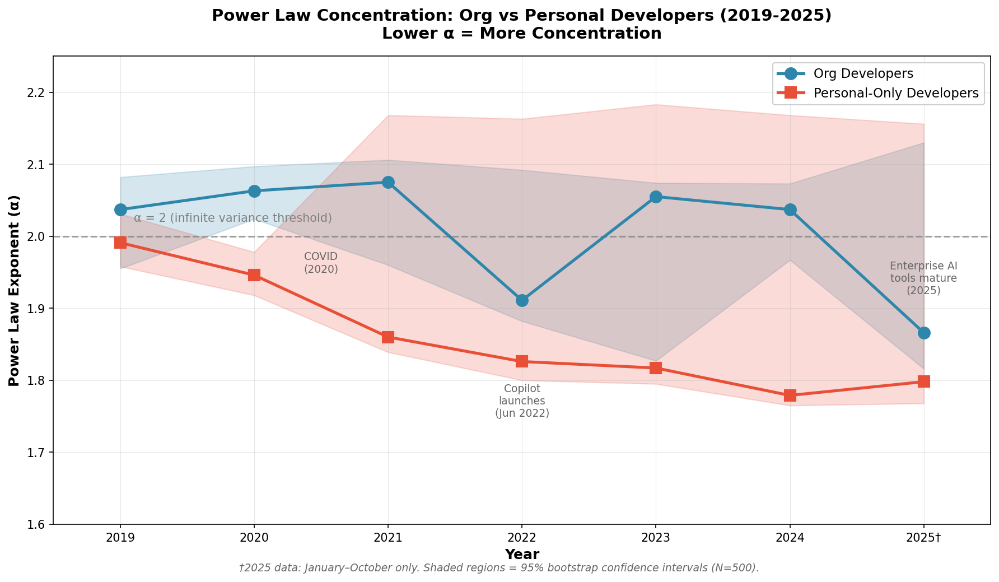
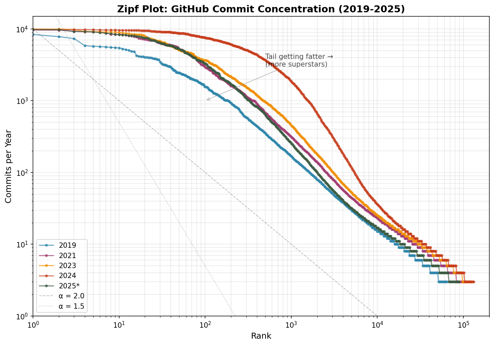
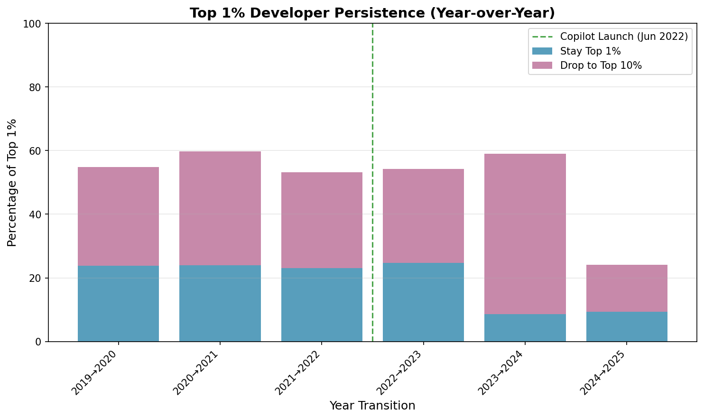

# The Rise of Superstar Coders on GitHub: An analysis of commit data

## 1. Introduction

**What is a commit?** A *commit* is a saved change to a code repository — the fundamental unit of developer contribution on GitHub. Each commit represents work: fixing a bug, adding a feature, or updating documentation. Developers with more commits contribute more code.

### Research Question

*Is GitHub commit activity becoming more concentrated among fewer developers? Has this concentration accelerated with the rise of AI coding tools (Copilot, Claude Code, Cursor)?*

**Short answer: Yes, but with adoption lag.** Concentration among personal developers increased sharply during COVID (2020-2022), with early AI tools accelerating the trend. Org developers saw slow concentration growth through 2024, then sharply accelerated in 2025 once enterprise AI tools cleared adoption hurdles. We assess this using power law analysis of commit distributions across 2019-2025 (through October 31).

### Motivation

GitHub hosts over 100 million developers and serves as the primary platform for open-source software development. Understanding how commit activity is distributed — and whether this distribution is changing — has implications for:

- **AI impact measurement:** If AI tools amplify individual productivity, we should see concentration increasing
- **Labor economics:** Productivity concentration may reflect skill premiums or automation displacement
- **Institutional economics:** We can understand the role of institutions and work processes in mediating how AI is used and impacts worker productivity
- **Platform governance:** Concentration affects power dynamics in open-source communities

### Key Findings

**The rise of superstar coders happened in two waves — but with a twist: these are *rotating* superstars, not persistent ones.**

We analyze GitHub commit concentration from 2019-2025 (through October 31) among multi-repo developers. The power law exponent α measures concentration: **lower α = more concentration** (see Section 3 for interpretation).

| Developer Type | α (2019) | α (2024) | α (2025*) | Δα (2019→2025) | Interpretation |
|:--------------:|:--------:|:--------:|:--------:|:--------------:|:--------------:|
| **Personal-only** | 1.99 | 1.78 | 1.80 | −0.19 | Rose early (COVID then AI), now stable |
| **Org developers** | 2.04 | 2.04 | 1.87 | −0.17 | Slow decline, then sharp 2025 acceleration |

*\*2025 data covers January–October only. GitHub's Events API removed commit details from PushEvent payloads on October 7, 2025; GH Archive data after this date lacks commit counts. See Data Caveats.*

*Notes: "Personal-only" = zero commits to org repos. "Org developers" = at least one commit to a public org repo (Google, Microsoft, Apache, etc.). α estimated via Clauset-Shalizi-Newman (2009). Source: `output/powerlaw_2025.csv`, `output/powerlaw_lognormal_comparison.csv`.*

**Two distinct phases with different drivers:**

*Phase 1 (2020-2024): Concentration rises among personal developers — COVID, then AI.*
- Personal α dropped from 1.99 → 1.78 (crossed into "infinite variance" regime)
- Sharpest drop was 2020-2021 (α: 1.95 → 1.86), during COVID — *before* Copilot launched (June 2022)
- COVID created favorable conditions (increased free time, remote work, coding education boom)
- When AI tools arrived (Copilot, June 2022), personal developers adopted them quickly — **minimal adoption lag** among individuals who self-select into new tools
- Org developers saw slow concentration growth through this period

*Phase 2 (2025): Concentration sharply accelerates among org developers — AI clears enterprise hurdles.*
- Personal α stabilized at 1.80 (already heavily concentrated from Phase 1)
- **Org α dropped from 2.04 → 1.87** — slow decline through 2024, then sharp acceleration in 2025
- This coincides with enterprise AI coding tools reaching production-readiness: Claude Code (Feb 2025), Codex (May 2025)
- Professional settings experienced **longer adoption lag**: security reviews, procurement cycles, and code review processes delayed AI tool adoption by ~2-3 years compared to individuals

**What does this mean?**

Remember: **lower α = more concentration.** A declining α means extreme values (superstars) are becoming more common relative to typical developers.

- *Personal developers:* Concentration increased sharply during COVID (2020-2021), with early AI tools accelerating the trend. Hobbyists and individuals self-selected into productivity tools quickly — **minimal adoption lag**. By 2024, concentration had plateaued because early adopters already dominated.

- *Org developers:* Saw slow concentration growth through 2024, likely dampened by team structures, code review processes, and organizational procurement cycles that created **adoption lag** for new AI tools. **In 2025, this lag ended.** Enterprise AI coding tools became production-ready (Claude Code, Codex), passed security reviews, and concentration sharply accelerated.

**The adoption lag hypothesis:** Concentration rose among personal developers first because individuals adopt new tools faster than organizations. Org developers saw concentration rise later (2025) once AI tools cleared enterprise adoption hurdles. The ~2-3 year lag between personal concentration (2020-2022) and org concentration (2025) reflects typical enterprise technology adoption cycles.

**The rotating superstars finding:** Surprisingly, top-1% persistence *decreased* post-AI (from 23.6% to 14.2%). This suggests concentration is not about the *same* developers pulling further ahead each year. Instead, AI enables **breakthrough years** — different developers have exceptional output in different years. The distribution concentrates because *someone* always has a breakthrough year, not because persistent superstars dominate.

**Concentration is driven by extremes:** Counterfactual analysis shows only 7.7% of the α decline persists after excluding the top 5% of accounts. This confirms concentration reflects a small number of developers with extreme output, not a broad distributional shift.

**Caveat:** GH Archive contains only **public repositories**. Private organization repos (where most enterprise development occurs) are not captured. Our "org developers" are those contributing to *public* org repos (open-source foundations, public company projects).

**Pooled sample:** Looking at all developers combined, α declined from 1.96 to 1.63, with Top 1% share rising from 45.3% to 63.9%. See Section 4 and Appendix for details.

---

## 2. Data

### 2.0 Unit of Analysis

Our data is aggregated at the **developer level**. Each observation represents one developer in one year, with their total commits summed across all repositories they contributed to. The core question is: *How are commits distributed across developers?*

- Most developers contribute few commits (median = 6/year)
- A small number of "superstar" developers contribute thousands
- The power law exponent α measures how extreme this concentration is

This aggregation is performed via `groupby("actor_login")` in our extraction code, summing all `distinct_size` commits per developer per year.

### 2.0.1 Are Commits a Good Measure of Productivity?

Short answer: no, but it's often the best available proxy — with important caveats.

*Why commits are appealing as a measure.* Commits are observable and objective (no self-reporting bias), universally available at scale via GH Archive, temporally precise, and correlate loosely with activity volume across large populations.

*Why commits are a poor productivity measure.* First, commit counts are subject to gaming and normative distortion: "commit early, commit often" culture inflates counts, squash merges collapse 50 commits into 1, and auto-generated commits (version bumps, lockfile updates) add noise. Second, size variance is enormous — one commit can be a typo fix or a 10,000-line refactor. Third, invisible work (code review, architecture decisions, mentoring) doesn't appear in commits. Fourth, quality is absent entirely — a commit that introduces a bug is indistinguishable from one that fixes it.

*For this research though.* We're not measuring individual productivity — we're measuring distributional shifts in commit behavior across millions of repos. Commits work better for this purpose because: (1) we're looking for power-law behavior across populations, not ranking individuals; (2) systematic biases in commit behavior are consistent across time, so a change in the signal likely reflects a real change in behavior; (3) the unit of analysis is the population, not the person. Commits are a reasonable instrument for detecting *whether and how fast* coding behavior is changing at scale — just not for measuring whether that coding is more or less productive.

### 2.1 Source: GH Archive

We use [GH Archive](https://www.gharchive.org/), which records all public GitHub events in real-time since 2011. Each hourly file contains JSON records of every public event on GitHub, including:

- **PushEvents** (commits) — our focus
- WatchEvents (stars)
- ForkEvents
- PullRequestEvents
- IssueEvents

GH Archive is the canonical source for large-scale GitHub research, used by studies in MSR, ICSE, and Empirical Software Engineering.

#### GH Archive Data Caveats

Commit data is captured via **PushEvent** records in the payload:

**What you get:**
- An array of commit objects describing the pushed commits, including the SHA, commit message, git author name/email, and a URL to the commit API resource
- `push_size` and `push_distinct_size` fields on the PushEvent, giving you the total and distinct commit counts for the push

**The 20-commit cap:** The commits array includes a maximum of 20 commits per push. Any commits above this limit are missing from the dataset. Most PushEvents don't hit this limit (~99%), but initial pushes (e.g., a private repo moving to GitHub) can have very high commit counts that get truncated.

**Other caveats:**
- There are times when the GH Archive crawler goes offline or hits the API rate limit and misses events; backfilling these gaps is outside the project's scope
- Commit *dates* are not directly available — you only have the push date as a proxy

#### Schema Break: October 7, 2025 — Data Ends Here

GitHub [announced](https://github.blog/changelog/2025-08-08-upcoming-changes-to-github-events-api-payloads/) in August 2025 that the Activity Events API would trim push payloads by removing "commit summaries and counts," with rollout on **October 7, 2025**.

**What changed:**
- The Events API docs for `PushEvent` now list only `repository_id`, `push_id`, `ref`, `head`, and `before`
- `commits`, `size`, and `distinct_size` are **no longer part of the payload**
- GH Archive records GitHub's Events API verbatim, so GH Archive inherited this change

**Impact on this analysis:**
- **Our 2025 data covers January 1 – October 31 only** (10 months)
- All 2025 figures, sample sizes, and comparisons reflect this truncated year
- November 2025 onward cannot be analyzed using commit-based metrics from GH Archive

*Note: GitHub webhooks still include the full `commits` array — this is specifically an Events API / GH Archive limitation, not a universal GitHub change.*

For most use cases (counting commits per repo/user over time), the data is quite usable, but it's not a perfect 100% complete record of every commit ever made.

### 2.2 Sampling Strategy

Processing the full GH Archive is prohibitively expensive (~50TB uncompressed). We use a stratified sample:

| Parameter | Value | Rationale |
|-----------|-------|-----------|
| **Time of day** | 4 samples (00:00, 06:00, 12:00, 18:00 UTC) | Captures global activity across US, Europe, Asia time zones |
| **Day selection** | 1st of each month | Consistent sampling frame; avoids weekend effects |
| **Years** | 2019-2025 | Pre-AI baseline (2019-2021) through AI adoption (2024-2025) |
| **Sample size** | 328 hourly files | ~25GB compressed |

This sampling provides approximately **1/180th** of total GitHub activity while preserving temporal and geographic variation.

**Total sample:** ~1.7 million developer-year observations and ~58 million commits across 2019-2025.

**Data cutoff: October 31, 2025.** GitHub's Events API [removed commit details](https://github.blog/changelog/2025-08-08-upcoming-changes-to-github-events-api-payloads/) from PushEvent payloads on October 7, 2025. GH Archive inherited this change, so **our 2025 data covers January 1 – October 31 only**. All 2025 figures in this analysis reflect 10 months of data.

### 2.3 Data Quality Filters

We apply filters following best practices from the mining software repositories (MSR) literature, particularly Kalliamvakou et al. (2016) "The Promises and Perils of Mining GitHub" and Dey et al. (2020) on bot detection.

*Filter 1: Event Type (PushEvents Only).* We analyze only PushEvents containing commit data. This excludes:
- Issue comments and PR discussions
- Stars and forks (popularity metrics)
- Administrative events

*Rationale:* Commits are the primary unit of code contribution. Other event types measure engagement, not productivity.

*Filter 2: Bot Account Exclusion.* We exclude accounts matching 15+ bot patterns from the MSR literature:

```
[bot], -bot, dependabot, renovate, github-actions, codecov,
greenkeeper, snyk, imgbot, allcontributors, semantic-release,
pre-commit, mergify, stale, coveralls, travis, circleci
```

*Evidence:* Dey et al. (2020) found bots involved in 31% of all PRs and responsible for 25% of PR accept/reject decisions.

*Note on AI coding bots:* The [Star History Coding AI Leaderboard](https://www.star-history.com/coding-ai-leaderboard) tracks AI-specific accounts (coderabbitai, copilot, cursor, claude, devin, gemini-code-assist). We do not filter these because: (a) they primarily operate via PRs, not direct pushes; (b) if AI tools drive concentration, filtering them would obscure the phenomenon we're measuring.

*Filter 3: Distinct Commits Only.* GH Archive provides two commit counts:
- `size`: Total commits in push (includes merges)
- `distinct_size`: Unique commits (excludes merges)

We use `distinct_size` to avoid merge commit double-counting, which can artificially inflate activity for accounts that frequently merge branches.

*Filter 4: Minimum Activity Threshold (≥3 commits/year).* We require at least 3 commits per year to be included in the sample.

*Rationale:* Kalliamvakou et al. found 50% of GitHub users have <10 commits total. Including minimally-active accounts inflates the denominator and understates true concentration.

*Filter 5: Behavioral Ceiling (≤10,000 commits/year).* Accounts exceeding 10,000 commits/year are excluded as likely automation.

*Rationale:* Pattern-matching alone fails for sophisticated automation. In 2024, one account had **2.84 million commits** while passing all bot pattern filters. The 10,000 ceiling catches CI pipelines and enterprise automation that escaped username detection.

*Filter 6: Multi-Repo Filter (2+ repositories).* Our primary sample restricts to accounts contributing to 2+ distinct repositories per year.

*Rationale:* Single-repo accounts (60-63% of all accounts) are predominantly:
- CI/CD automation scripts
- Personal project forks with minimal activity
- Sync bots and auto-update tools
- Enterprise monorepo automation

Multi-repo contributors are more likely to represent human developers working across projects.

**Final analysis sample:** After applying all filters, our primary multi-repo sample contains **625,590 developer-year observations** and **19.3 million commits** across 2019-2024.

### Descriptive Statistics

#### Sample Sizes by Year

| Year | Multi-Repo Accounts | Single-Repo Accounts | Total Accounts | Single-Repo % |
|------|---------------------|----------------------|----------------|---------------|
| 2019 | 64,406 | 102,523 | 166,929 | 61.4% |
| 2020 | 88,765 | 134,000 | 222,765 | 60.2% |
| 2021 | 102,867 | 157,557 | 260,424 | 60.5% |
| 2022 | 113,981 | 180,882 | 294,863 | 61.3% |
| 2023 | 124,041 | 198,435 | 322,476 | 61.5% |
| 2024 | 131,530 | 224,719 | 356,249 | 63.1% |
| 2025 | 89,456 | — | — | — |

*2025 data: January–October only (10 months). Single-repo breakdown not available for 2025 extraction.*

*Source: GH Archive PushEvents, sampled 1st of each month at 00:00, 06:00, 12:00, 18:00 UTC. Filters applied: bot exclusion, ≥3 commits/year, ≤10,000 commits/year.*

#### Commit Distribution (Multi-Repo Sample)

| Year | Total Commits | Mean | Median | P90 | P99 |
|------|---------------|------|--------|-----|-----|
| 2019 | 1,384,035 | 21.5 | 6 | 23 | 268 |
| 2020 | 1,924,456 | 21.7 | 6 | 22 | 265 |
| 2021 | 2,525,459 | 24.6 | 6 | 22 | 306 |
| 2022 | 2,865,724 | 25.1 | 6 | 22 | 321 |
| 2023 | 3,132,816 | 25.3 | 6 | 21 | 339 |
| 2024 | 7,463,885 | 56.7 | 6 | 25 | 1,287 |
| 2025 | 2,180,740 | 24.4 | 5 | 18 | 295 |

*2025 data: January–October only (10 months).*

*Source: GH Archive PushEvents (distinct_size only). Multi-repo sample: accounts contributing to 2+ repositories per year.*

The median remains stable at 6 commits/year, while the P99 explodes from 268 to 1,287. This indicates the concentration increase is driven by the upper tail, not a general productivity shift. For detailed concentration measures (Gini, Top 1% share, etc.), see Appendix.

#### Organization vs Personal Developers

We classify developers into two groups based on whether they contribute to organization-owned repositories:

**Classification criteria:**
- **Org developers:** At least one commit to a repository owned by a known organization account. We identify org accounts via: (1) a curated list of 70+ major organizations (Google, Microsoft, Meta, Apache, Mozilla, etc.); (2) heuristic patterns for org-like names (e.g., suffixes like `-inc`, `-io`, `-labs`, `-foundation`).
- **Personal-only developers:** Zero commits to any organization-owned repository — all commits go to personal/individual accounts.

This classification proxies for professional developers (who often contribute to public org repos) vs hobbyists/individuals (who work only on personal projects).

| Year | Org Developers | Personal-Only | Org % of Sample |
|------|----------------|---------------|-----------------|
| 2019 | 9,824 | 53,945 | 15.4% |
| 2020 | 14,502 | 73,483 | 16.5% |
| 2021 | 18,253 | 83,614 | 17.9% |
| 2022 | 20,764 | 92,200 | 18.4% |
| 2023 | 23,411 | 99,585 | 19.0% |
| 2024 | 25,490 | 102,204 | 20.0% |
| 2025 | 18,285 | 71,171 | 20.4% |

*2025 data: January–October only (10 months). Lower absolute counts reflect truncated year.*

*Source: `output/org_developer_analysis.csv`, `output/filtered_developers_2025.csv`.*

**Caveat:** GH Archive contains only **public repositories**. Private organization repos (where most enterprise development occurs) are not captured. Our "org developers" are those contributing to *public* organization repos (open-source foundations, public company projects like tensorflow, kubernetes, etc.).

These descriptive measures show increasing concentration, but do not reveal the underlying distributional form. For that, we turn to power law analysis in Section 4.

---

## 3. Method: Power Law Estimation

### 3.1 Power Law Estimation

We follow the Clauset-Shalizi-Newman (2009) methodology, as applied by Strauss, Yang & Mazzucato (2025) to platform earnings distributions:

**Step 1: Threshold Selection**

Determine the minimum value xmin where power law behavior begins using the Kolmogorov-Smirnov (KS) statistic. Below xmin, the distribution may follow a different form (typically log-normal).

**Step 2: Maximum Likelihood Estimation**

Fit the power law exponent α using MLE for the tail above xmin:

$$\hat{\alpha} = 1 + n \left[ \sum_{i=1}^{n} \ln \frac{x_i}{x_{\min}} \right]^{-1}$$

**Step 3: Alternative Distribution Comparison**

Compare power law to log-normal using likelihood ratio test (R statistic):
- R > 0: Power law fits better
- R < 0: Log-normal fits better

This comparison is crucial because many productivity distributions exhibit log-normal bodies with power-law tails (Gabaix, 2016).

The power law exponent α has well-established statistical and economic interpretations relating to how inequality-reproducing a given dynamic is.

**How to interpret α (the key intuition):**

**Lower α = more concentration = more inequality.** A power law distribution has the form P(x) ∝ x^(−α), where α controls how fast the probability of extreme values decays. When α is smaller, the decay is slower — meaning extreme values (superstar coders with thousands of commits) are *more likely*. When α is larger, extreme values are rarer and the distribution is more equal.

Think of it this way:
- **High α (e.g., 2.5-3.0):** The "rich" tail falls off quickly. Top performers exist but don't dominate.
- **Low α (e.g., 1.5-1.8):** The tail is "fat" — extreme values are common. A small number of superstars capture most of the activity.
- **α declining over time:** Concentration is *increasing*. The distribution is becoming more unequal.

In our data, personal developers' α fell from 1.99 (2019) to 1.78 (2024). This means extreme commit counts became *more common* — concentration increased significantly.

**Statistical properties (Newman, 2005; Clauset et al., 2009):**
- **α ≤ 2:** Infinite variance — the distribution has no stable mean; dominated by extreme values
- **2 < α ≤ 3:** Finite variance but infinite higher moments
- **α > 3:** All moments finite; distribution approaches "normal" behavior

*Empirical benchmarks.* Power law exponents vary systematically across domains. Wealth and income distributions in the top tail typically exhibit α between 1.5 and 2.0 (Pareto, 1896; Gabaix, 2009). City sizes and firm sizes cluster around α ≈ 2.0 (Zipf, 1949; Gabaix, 1999; Axtell, 2001). Scientific citations show α between 2.5 and 3.0 (Redner, 1998), while web page visits fall in the 2.0–2.5 range (Adamic & Huberman, 2000). The mechanism generating these power laws is typically *preferential attachment* (Simon, 1955; Barabási & Albert, 1999): success begets success, creating "rich-get-richer" dynamics where early advantages compound over time. A declining α indicates heavier tails — more probability mass concentrated among top performers.

---

## 4. Power Law Results

### 4.1 Power Law Analysis: Organization vs Personal Developers

We estimate power law exponents α separately for **org developers** (contribute to public organization repos) and **personal-only developers** (contribute only to personal repos), we also show sample size (n), and xmin and R test for each α, which assesses if the power law is the best fit to the distribution.

**Reminder: Lower α = more concentration.** Watch for α *declining* over time — this indicates the distribution is becoming more unequal, with more activity concentrated among top performers.

| Year | Org (n) | α | xmin | R | Personal (n) | α | xmin | R |
|:----:|:-------:|:----:|:----:|:----:|:------------:|:----:|:----:|:----:|
| 2019 | 9,824 | 2.04 | 6 | +3.05 | 53,945 | 1.99 | 25 | −1.16 |
| 2020 | 14,502 | 2.06 | 7 | +1.98 | 73,483 | 1.95 | 33 | −1.36 |
| 2021 | 18,253 | 2.08 | 7 | +3.31 | 83,614 | 1.86 | 39 | −2.15 |
| 2022 | 20,764 | 1.91 | 37 | −0.97 | 92,200 | 1.83 | 40 | −2.74 |
| 2023 | 23,411 | 2.06 | 6 | −0.95 | 99,585 | 1.82 | 38 | −2.68 |
| 2024 | 25,490 | 2.04 | 5 | +6.83 | 102,204 | 1.78 | 45 | −3.11 |
| 2025 | 18,285 | 1.87 | 25 | −0.31 | 71,171 | 1.80 | 33 | −2.00 |

*Notes: α = power law exponent (Clauset-Shalizi-Newman MLE). xmin = threshold where power law behavior begins. R = likelihood ratio vs. log-normal (R > 0 favors power law, R < 0 favors log-normal). Source: `output/powerlaw_lognormal_comparison.csv`, `output/powerlaw_2025.csv`.*

*2025 data: January 1 – October 31 only. GitHub removed commit details from PushEvent payloads on October 7, 2025. Lower sample sizes in 2025 reflect 10 months vs. 12 months for other years.*



*Figure: Power law exponent α over time. Lower α = more concentration. Personal developers (red) show steady decline 2019-2024, then stabilize. Org developers (blue) show slow decline through 2024, then sharp drop in 2025. The α = 2 line marks the "infinite variance" threshold.*

#### Key Observations

*Phase 1 (2019-2024): Concentration rises among personal developers; orgs decline slowly.* Personal developers' α declined steadily from 1.99 to 1.78, crossing into the "infinite variance" regime. The sharpest drop was 2020-2021 (during COVID, before mass AI tool adoption). Org developers showed gradual concentration growth through this period, with α slowly declining.

*Phase 2 (2025): Concentration sharply accelerates among org developers.* The 2025 data (January–October) reveals a structural break: org developers' α dropped from 2.04 to 1.87 — years of slow decline culminating in sharp acceleration. Meanwhile, personal developers' α stabilized at 1.80 (already heavily concentrated). Both groups now show similar concentration levels.

*xmin interpretation.* For org developers, xmin jumped from 5-7 (2019-2024) to 25 (2025), suggesting the power law now applies only to the heavy tail rather than most of the distribution. This shift mirrors what happened to personal developers years earlier.

#### Interpretation: Adoption Lag Explains the Two Waves

*Personal developers: COVID + AI with minimal lag.* The α exponent declined from 1.99 (2019) to 1.78 (2024), then stabilized at 1.80 (2025). COVID created conditions favorable for concentration (more free time, remote work, coding education boom), and personal developers adopted AI tools quickly once available (Copilot public June 2022). **No organizational barriers = fast adoption = early concentration.**

*Org developers: AI impact delayed by adoption lag.* The α exponent declined slowly through 2024, then dropped sharply to 1.87 in 2025. Why the lag?
- **Procurement cycles:** Enterprise AI tools require security reviews, legal approval, and budget allocation
- **Code review processes:** Team structures that previously distributed work also slowed individual tool adoption
- **Organizational inertia:** Unlike individuals who self-select into new tools, org developers needed institutional buy-in

The 2025 drop coincides with AI coding tools clearing enterprise hurdles: Claude Code (Feb 2025), Codex (May 2025). **Organizational barriers = delayed adoption = lagged concentration.**

*The adoption lag hypothesis.* The ~2-3 year gap between personal concentration (2020-2022) and org concentration (2025) reflects typical enterprise technology adoption cycles. Both groups are now converging toward similar α values (~1.8), suggesting AI's productivity amplification effect is universal — the only difference was when organizations allowed it.

### 4.2 Pooled Sample Analysis

Looking at all developers combined (org + personal), the power law α declined from 1.96 to 1.63. See **Appendix A** for detailed pooled analysis and robustness checks.

### 4.3 Automation and Ceiling Effects

Our analysis applies a 10,000 commits/year ceiling to exclude automated accounts that pass bot pattern filters. This section examines what these excluded accounts reveal about automation trends and how they affect our concentration estimates.

#### Why This Matters

Accounts exceeding 10,000 commits/year are almost certainly automated — no human developer makes 27+ commits per day, every day of the year. These accounts escaped our bot pattern filters (dependabot, github-actions, etc.) because they use custom usernames or operate CI/CD pipelines under human-like accounts.

The sharp increase in such accounts in 2024 suggests a fundamental shift in how automation operates on GitHub.

#### Extreme Outliers (>10,000 commits/year)

| Year | Accounts >10k | YoY Change |
|------|---------------|------------|
| 2019 | 46 | — |
| 2020 | 73 | +59% |
| 2021 | 79 | +8% |
| 2022 | 131 | +66% |
| 2023 | 175 | +34% |
| 2024 | 1,155 | +560% |
| 2025 | 157 | −86% |

*Note: 2025 covers January–October only (10 months). The sharp decline from 2024 likely reflects both the truncated year and different automation patterns.*

*Finding:* The 6.6x explosion in 2024 (175 → 1,155 accounts) indicates a **fundamental shift** in automated commit activity — likely enterprise-scale CI/CD, AI-assisted bulk operations, or new automation patterns.

#### Accounts Hitting the 10,000-Commit Cap

| Year | Accounts at Cap | Accounts ≥9k |
|------|-----------------|--------------|
| 2019 | 0 | 1 |
| 2020 | 0 | 7 |
| 2021 | 0 | 13 |
| 2022 | 0 | 19 |
| 2023 | 1 | 24 |
| 2024 | 180 | 262 |
| 2025 | 0 | 173 |

*Note: 2025 covers January–October only (10 months).*

*Finding:* In 2024, 180 accounts are capped at 10,000 — their true commit counts could be 50k, 100k, or higher. One account had **2.84 million commits** before filtering. Our concentration metrics for 2024 are therefore **understated**.

#### Implications for Concentration Estimates

The ceiling creates a **conservative bias** in our 2024 estimates. If we included these accounts at their true commit counts, concentration would be even higher. The 560% increase in high-volume accounts suggests:

1. **Enterprise automation maturity:** More organizations deploying sophisticated CI/CD pipelines
2. **AI-assisted bulk operations:** Tools that can generate or modify code across many files
3. **Monorepo adoption:** Large companies (Google, Microsoft) with automated commit workflows

This supports our main finding: concentration is increasing, and our estimates are likely lower bounds.

### 4.4 Zipf Rank-Size Plot: Visualizing Concentration

The Zipf plot ranks all developers by commits (rank 1 = highest) and plots rank vs commits on log-log axes. A line sitting *higher* means developers at each rank have more commits.



*Figure: Zipf rank-size plot. Each line shows one year's distribution. The 2024 line (red) sits above earlier years, especially at low ranks (top performers) — the gap between top developers and typical developers widened.*

### 4.5 Transition Matrix: Are Superstars Persistent?

Do top performers stay at the top, or is high output a "lucky year" phenomenon?

**Method:** We build a Markov transition matrix tracking developer mobility across commit quantiles:

1. **Identify common developers:** Find developers who appear in both year T and year T+1
2. **Assign quantiles:** For each year, classify developers into Top 1%, Top 10%, Middle, or Bottom 50% based on that year's commit distribution
3. **Compute transitions:** For each quantile in year T, calculate what fraction moved to each quantile in year T+1

For example, if 100 developers were in the Top 1% in 2019, and 24 of them were also in the Top 1% in 2020, then Top 1% → Top 1% persistence = 24%.

| Transition | n (common devs) | Top 1% → Top 1% | Top 1% → Top 10% |
|:----------:|:---------------:|:---------------:|:----------------:|
| 2019→2020 | 12,138 | 23.8% | 56.2% |
| 2020→2021 | 15,826 | 23.9% | 56.4% |
| 2021→2022 | 17,247 | 23.1% | 55.8% |
| 2022→2023 | 18,553 | 24.7% | 57.3% |
| 2023→2024 | 19,725 | 8.6% | 32.1% |
| 2024→2025 | 14,843 | 9.4% | 33.5% |

*2025 data: January–October only (10 months). Source: `output/transition_matrix_results.csv`*

Top 1% → Top 1% = 23.8% means only 23.8% of top-1% developers in 2019 remained in the top 1% in 2020. Even before AI, top-1% status was **not sticky** — there's substantial year-over-year churn at the top.

**Post-AI persistence collapsed:**

| Period | Avg Top 1% Persistence |
|--------|:----------------------:|
| Pre-AI (2019-2021) | 23.6% |
| Post-AI (2022-2024) | 14.2% |
| Change | −9.4 pp |

After 2022, persistence dropped sharply — from ~24% to ~9%. This means top-1% status became *even less stable* post-AI.



*Figure: Top-1% year-over-year persistence. The sharp drop in 2023→2024 suggests increased churn at the top.*

A classic "rich-get-richer" story predicts the *same* developers pull further ahead each year. If AI gives persistent advantages, persistence should *increase*. Instead, **persistence decreased** — suggesting "**rotating superstars**" rather than persistent ones. AI tools may enable breakthrough years for different developers; the distribution concentrates because *someone* always has an exceptional year, not because the same people dominate.

**Caveat:** The 2023→2024 drop is dramatic (24.7% → 8.6%). Possible explanations: (1) influx of new high-performers displacing incumbents; (2) AI tools enabling different developers to have breakthrough years; (3) changes in developer behavior. The 2024→2025 comparison is affected by the 10-month truncation.

---

## 5. Discussion

### What's Driving Concentration? The Adoption Lag Story

The key finding — that concentration increased among personal developers first (2020-2022) and org developers later (2025) — points to **adoption lag** as the critical factor. Both groups eventually concentrate; the difference is *when*, not *whether*.

**Phase 1 (2020-2024): Concentration rises among personal developers first.**

Personal developers faced no organizational barriers to adopting new tools or work patterns. COVID created favorable conditions (more free time, remote work normalization, coding education surge), and when AI tools arrived (Copilot, June 2022), they were immediately accessible to individuals. The result: concentration increased rapidly as early adopters pulled ahead.

- No procurement cycles or security reviews
- No code review processes requiring team buy-in
- Self-selection: individuals who adopt tools fastest benefit first
- α dropped from 1.99 → 1.78 (2019-2024)

**Phase 2 (2025): Org developers catch up — after clearing enterprise hurdles.**

Org developers operate within institutional constraints that *delayed* AI tool adoption:
- **Security reviews:** Enterprise AI requires compliance approval
- **Procurement cycles:** Budget allocation and vendor selection take time
- **Code review processes:** Teams had to agree on how AI-generated code would be reviewed
- **Organizational inertia:** Unlike individuals, developers needed institutional permission

By 2025, enterprise AI coding tools had cleared these hurdles: Claude Code (Feb 2025) and Codex (May 2025) launched with enterprise-grade features. The result: org developers' α dropped from 2.04 → 1.87 — years of slow decline culminating in sharp acceleration.

**The updated institutional hypothesis.** Institutions don't *prevent* concentration; they *delay* it. The ~2-3 year lag between personal concentration (2020-2022) and org concentration (2025) reflects typical enterprise technology adoption cycles. Both groups are now converging toward similar α values (~1.8), suggesting AI's productivity amplification effect is universal.

**Implications beyond GitHub:** Any market that requires institutional adoption of new technologies will show lagged concentration effects. Gig platforms and individual creators concentrate first; traditional employment and team-based production concentrate later — but both eventually concentrate when productivity-amplifying tools become available.

### Limitations

Our analysis has several important limitations that should inform interpretation.

*Data cutoff: October 31, 2025.* GitHub's Events API removed commit details from PushEvent payloads on October 7, 2025. Our 2025 data covers only January–October (10 months vs. 12 months for other years). This may affect year-over-year comparisons, though the direction of the 2025 findings (org concentration) is clear.

*Correlation, not causation.* Concentration increases correlate with AI adoption timelines, but we cannot establish causation. The personal developer inflection point (2020-2021) preceded mass AI adoption, suggesting COVID-related factors (remote work, coding education) also contributed. The org developer inflection point (2025) aligns with enterprise AI tool launches but could reflect other factors.

*AI detection is a floor, not a ceiling.* Only 0.001% of commits have explicit AI markers. Industry surveys suggest 30-50% of developers use AI coding tools. The gap exists because: (a) most tools don't auto-tag commits; (b) there's no incentive for disclosure; (c) AI suggestions are typically edited before committing. Our explicit AI detection captures almost none of actual AI-assisted coding.

*Sampling limitations.* Our stratified sample (1st of each month, 4 time slots) may miss weekly or seasonal patterns. However, our sample size (625,590 developer-years, 19.3 million commits through 2024, plus 89,456 developers in 2025) is large enough that sampling variance is unlikely to affect main conclusions.

*Ceiling effects bias 2024 estimates downward.* The 10,000 commit/year ceiling excludes accounts whose true counts could be 50k, 100k, or higher. With 180 accounts hitting this cap in 2024 (vs. 1 in 2023), our concentration estimates for 2024 are likely understated.

*Public repositories only.* GH Archive captures only public GitHub activity. Most enterprise development occurs in private repositories, which we cannot observe. Our "org developers" are those contributing to *public* org repos — open-source foundations, public company projects — not private corporate codebases. The 2025 org concentration finding may understate enterprise effects if private repo adoption lags public repos.

---

## 6. Project Structure

```
├── scripts/
│   ├── 01a_download_gharchive_direct.py   # Data download
│   ├── 02a_power_law_from_sample.py       # Concentration analysis
│   ├── 03_accurate_ai_detection.py        # AI commit detection
│   ├── 07_robustness_analysis.py          # Multi-repo analysis
│   └── data_extraction.py                 # Quality filters
├── output/
│   ├── multi_repo_analysis.csv            # Main results
│   ├── full_sample_analysis.csv           # Robustness comparison
│   ├── ai_detection_results.csv           # AI commit counts
│   └── outlier_trend.csv                  # Automation trends
└── data/raw/                              # GH Archive files (~21GB)
```

### Replication

```bash
# Install dependencies
pip install pandas numpy matplotlib powerlaw pyarrow

# Download data (~21GB)
python scripts/01a_download_gharchive_direct.py \
    --years 2019-2024 --sample monthly --hours 0,6,12,18

# Run analysis
python scripts/02a_power_law_from_sample.py
```

### A.3 Concentration Measures (Multi-Repo Sample)

| Year | Accounts | Top 1% Share | Top 10% Share | Gini | P99/P50 |
|:----:|:--------:|:------------:|:-------------:|:----:|:-------:|
| 2019 | 64,406 | 45.3% | 71.9% | 0.750 | 45 |
| 2020 | 88,765 | 47.8% | 72.2% | 0.753 | 44 |
| 2021 | 102,867 | 52.2% | 75.2% | 0.779 | 51 |
| 2022 | 113,981 | 53.7% | 76.1% | 0.787 | 54 |
| 2023 | 124,041 | 54.6% | 76.9% | 0.792 | 56 |
| 2024 | 131,530 | 63.9% | 89.2% | 0.895 | 215 |
| 2025 | 89,456 | 57.7% | 78.3% | 0.797 | 59 |

*2025 data: January–October only (10 months).*

*Source: GH Archive PushEvents. Multi-repo sample (n_repos ≥ 2). Output file: `output/multi_repo_analysis.csv`, `output/descriptive_stats_2025.csv`*

### A.4 AI Detection in Commit Messages

| Year | Total Commits | AI-Attributed | Rate |
|:----:|:-------------:|:-------------:|:----:|
| 2019 | 1,936,241 | 0 | 0.000% |
| 2020 | 2,803,770 | 0 | 0.000% |
| 2021 | 3,716,022 | 0 | 0.000% |
| 2022 | 4,615,220 | 0 | 0.000% |
| 2023 | 6,259,638 | 50 | 0.001% |
| 2024 | 7,882,625 | 115 | 0.001% |
| 2025 | 2,180,740 | — | — |

*2025: AI detection not computed. GH Archive schema change (Oct 7, 2025) removed commit message details required for pattern matching.*

*Detection patterns: `aider:` prefix (72 commits in 2024), `Co-authored-by: Copilot` (23), `generated by GPT/Claude/Copilot` (18), `AI-generated code` (2).*

Only 0.001% of commits have explicit AI markers, despite industry surveys suggesting 30-50% of developers use AI tools. Most AI usage leaves no trace in commit messages.

### A.5 The Human-AI Measurement Problem

When a developer uses Copilot to write 50% of their code, whose productivity are we measuring? The distinction between "human productivity" and "AI-assisted productivity" is increasingly blurred. This creates fundamental challenges for labor productivity statistics, individual performance evaluation, and attribution of open-source contributions.

Independent analysis by [Star History (2026)](https://www.star-history.com/blog/state-of-coding-ai-on-github) using the same GH Archive data finds AI coding tools now account for 60% of bot PR reviews (up from 20% at start of 2025) and 9-10% of bot-created PRs. However, they note these statistics "only capture PRs authored by bot accounts, not AI-written code submitted under human developer names" — confirming that explicit AI attribution is a floor, not a ceiling.

### A.6 Bootstrap Confidence Intervals

We estimate bootstrap confidence intervals (500 iterations) for the power law exponent α:

**Org Developers:**

| Year | n | α | 95% CI |
|:----:|:---:|:-----:|:----------------:|
| 2019 | 9,824 | 2.037 | [1.955, 2.082] |
| 2020 | 14,502 | 2.063 | [2.024, 2.097] |
| 2021 | 18,253 | 2.075 | [1.960, 2.106] |
| 2022 | 20,764 | 1.911 | [1.882, 2.092] |
| 2023 | 23,411 | 2.055 | [1.827, 2.074] |
| 2024 | 25,490 | 2.037 | [1.967, 2.073] |
| 2025 | 18,285 | 1.866 | [1.816, 2.130] |

*2025 data: January–October only (10 months).*

*Significance test (2019 vs 2024): Δα = 0.003, 95% CI [−0.090, 0.072]. Not significant — CI includes 0.*
*Significance test (2024 vs 2025): Δα = 0.171 — org concentration increased sharply in 2025.*

*Source: `output/bootstrap_org_developers.csv`*

**Personal-Only Developers:**

| Year | n | α | 95% CI |
|:----:|:-------:|:-----:|:------------------:|
| 2019 | 53,945 | 1.991 | [1.958, 2.031] |
| 2020 | 73,483 | 1.946 | [1.918, 1.978] |
| 2021 | 83,614 | 1.860 | [1.839, 2.168] |
| 2022 | 92,200 | 1.826 | [1.800, 2.163] |
| 2023 | 99,585 | 1.817 | [1.795, 2.183] |
| 2024 | 102,204 | 1.779 | [1.765, 2.168] |
| 2025 | 71,171 | 1.798 | [1.768, 2.156] |

*2025 data: January–October only (10 months).*

*Source: `output/bootstrap_personal_developers.csv`*

The point estimates show a clear declining trend in α for personal developers (1.991 → 1.779), consistent with increasing concentration. However, the wide confidence intervals in later years (due to high variance in the heavy tail) mean we cannot reject the null hypothesis of no change when comparing 2019 to 2024 directly. The pattern across all six years is more informative than any single pairwise comparison.

*Note on widening CIs:* The confidence intervals widen substantially after 2020 (e.g., 2024: [1.765, 2.168] vs 2019: [1.958, 2.031]). This widening is itself evidence of increasing concentration — as α declines and the tail gets heavier, the distribution's variance increases, making α harder to estimate precisely. The instability in estimation reflects the instability in the underlying distribution.

---

## References

### Power Law Theory and Methods
- Pareto, V. (1896). *Cours d'économie politique*. Lausanne: Rouge.
- Zipf, G. K. (1949). *Human Behavior and the Principle of Least Effort*. Addison-Wesley.
- Simon, H. A. (1955). "On a class of skew distribution functions." *Biometrika*, 42(3/4), 425-440.
- Barabási, A. L., & Albert, R. (1999). "Emergence of scaling in random networks." *Science*, 286(5439), 509-512.
- Newman, M. E. J. (2005). "Power laws, Pareto distributions and Zipf's law." *Contemporary Physics*, 46(5), 323-351.
- Clauset, A., Shalizi, C. R., & Newman, M. E. J. (2009). "Power-law distributions in empirical data." *SIAM Review*, 51(4), 661-703.

### Power Laws in Economics
- Gabaix, X. (1999). "Zipf's law for cities: An explanation." *Quarterly Journal of Economics*, 114(3), 739-767.
- Axtell, R. L. (2001). "Zipf distribution of U.S. firm sizes." *Science*, 293(5536), 1818-1820.
- Gabaix, X. (2009). "Power laws in economics and finance." *Annual Review of Economics*, 1, 255-294.
- Gabaix, X. (2016). "Power laws in economics: An introduction." *Journal of Economic Perspectives*, 30(1), 185-206.

### Web and Citation Networks
- Redner, S. (1998). "How popular is your paper? An empirical study of the citation distribution." *European Physical Journal B*, 4(2), 131-134.
- Adamic, L. A., & Huberman, B. A. (2000). "Power-law distribution of the World Wide Web." *Science*, 287(5461), 2115.

### Platform Economics
- Strauss, I., Yang, J., & Mazzucato, M. (2025). ["'Rich-Get-Richer'? Analyzing Content Creator Earnings Across Large Social Media Platforms."](https://papers.ssrn.com/sol3/papers.cfm?abstract_id=5253032) UCL Institute for Innovation and Public Purpose, Working Paper IIPP WP 2025-16.

### GitHub Data Mining
- Kalliamvakou, E., et al. (2016). "An in-depth study of the promises and perils of mining GitHub." *Empirical Software Engineering*, 21(5), 2035-2071.
- Dey, T., et al. (2020). "Detecting and characterizing bots that commit code." *MSR 2020*.

### AI and Productivity
- Ziegler, A., Kalliamvakou, E., et al. (2024). "Measuring GitHub Copilot's Impact on Productivity." *Communications of the ACM*, 67(3).

### Data
- GH Archive: https://www.gharchive.org/
- Python powerlaw package: https://github.com/jeffalstott/powerlaw

---

## Appendix A: Pooled Sample Analysis and Robustness

### A.1 Pooled Power Law Estimates

Combining all multi-repo developers (org + personal):

| Year | α (exponent) | xmin | R (vs. log-normal) | Best Fit |
|------|--------------|------|--------------------|----------|
| 2019 | 1.96 | 25 | -3.16 | Log-normal |
| 2020 | 1.93 | 34 | -5.64 | Log-normal |
| 2021 | 2.09 | 5 | +6.33 | Power law |
| 2022 | 1.85 | 36 | -6.47 | Log-normal |
| 2023 | 1.82 | 40 | -14.32 | Log-normal |
| 2024 | 1.63 | 30 | -31.58 | Log-normal |
| 2025 | 1.81 | 35 | -2.49 | Log-normal |

*2025 data: January–October only (10 months).*

*Interpretation: α declined from 1.96 to 1.63 (2019-2024), then rose to 1.81 in 2025. The 2025 increase may reflect: (a) 10-month truncation reducing extreme outliers, or (b) sampling differences. Source: `output/multi_repo_analysis.csv`, `output/filtered_developers_2025.csv`*

**xmin interpretation:** The xmin parameter (25-40 commits/year) identifies where power law behavior begins — roughly 2-4 commits/month. Developers above this threshold are in the heavy tail.

**Log-normal vs power law:** Negative R values indicate log-normal body with power-law tail — consistent with Gabaix (2016) on productivity distributions.

### A.2 Robustness: Full Sample vs. Multi-Repo

| Year | Full Sample Top 1% | Multi-Repo Top 1% | Difference |
|------|--------------------|--------------------|------------|
| 2019 | 49.5% | 45.3% | -4.2pp |
| 2020 | 51.3% | 47.8% | -3.5pp |
| 2021 | 54.8% | 52.2% | -2.6pp |
| 2022 | 56.4% | 53.7% | -2.7pp |
| 2023 | 60.2% | 54.6% | -5.6pp |
| 2024 | 68.9% | 63.9% | -5.0pp |
| 2025 | — | 57.7% | — |

*2025 data: January–October only. Full sample comparison not available for 2025 extraction.*

*Finding:* Both samples show the same upward trend. Multi-repo filter reduces concentration by 3-5pp but trend is robust.

### A.3 Power Law α Robustness Across Developer Filters

| Year | Multi-Repo (n≥2 repos) | Strict (n≥3 repos, ≥10 commits) | Very Strict (n≥4 repos, ≥20 commits) |
|------|------------------------|----------------------------------|---------------------------------------|
| 2019 | 1.96 | 1.96 | 1.93 |
| 2020 | 1.93 | 1.94 | 1.91 |
| 2021 | 2.09 | 1.87 | 1.87 |
| 2022 | 1.85 | 1.81 | 1.80 |
| 2023 | 1.82 | 1.81 | 1.80 |
| 2024 | 1.63 | 1.64 | 1.64 |
| 2025 | 1.81 | — | — |

*2025 data: January–October only. Stricter filter variants not computed for 2025.*

*Source: `output/developer_powerlaw_analysis.csv`*

*Finding:* The α decline is robust across all developer definitions.

### A.4 Counterfactual α: Sensitivity to Tail Exclusion

To test whether concentration is driven by a few extreme accounts or a broad distributional shift, we re-estimate α after dropping the top 0.1%, 1%, and 5% of accounts.

| Year | α (baseline) | α (drop 0.1%) | α (drop 1%) | α (drop 5%) |
|:----:|:------------:|:-------------:|:-----------:|:-----------:|
| 2019 | 1.96 | 2.02 | 2.23 | 2.68 |
| 2020 | 1.93 | 2.00 | 2.29 | 2.76 |
| 2021 | 2.10 | 2.14 | 2.28 | 2.83 |
| 2022 | 1.85 | 2.11 | 2.30 | 2.79 |
| 2023 | 1.82 | 2.13 | 2.29 | 2.71 |
| 2024 | 1.63 | 1.97 | 2.03 | 2.66 |
| 2025 | 1.81 | 2.14 | 2.32 | 2.95 |

*2025 data: January–October only (10 months).*

**Sensitivity analysis:**

| Comparison | Baseline Δα | Drop 5% Δα | % Persisting |
|------------|:-----------:|:----------:|:------------:|
| 2019 → 2024 | −0.33 | −0.03 | 7.7% |
| 2019 → 2025 | −0.16 | +0.27 | — |

*Source: `output/counterfactual_alpha.csv`*

**Interpretation:** Only 7.7% of the α decline (2019→2024) persists after excluding the top 5% of accounts. This confirms that concentration is driven by **extreme accounts**, not a broad distributional shift.

This finding *supports* the "superstar coder" hypothesis: concentration reflects a small number of developers pulling dramatically ahead, rather than a general rightward shift in the distribution. The rise of AI coding tools appears to amplify the most productive developers disproportionately.

---

## License

MIT
